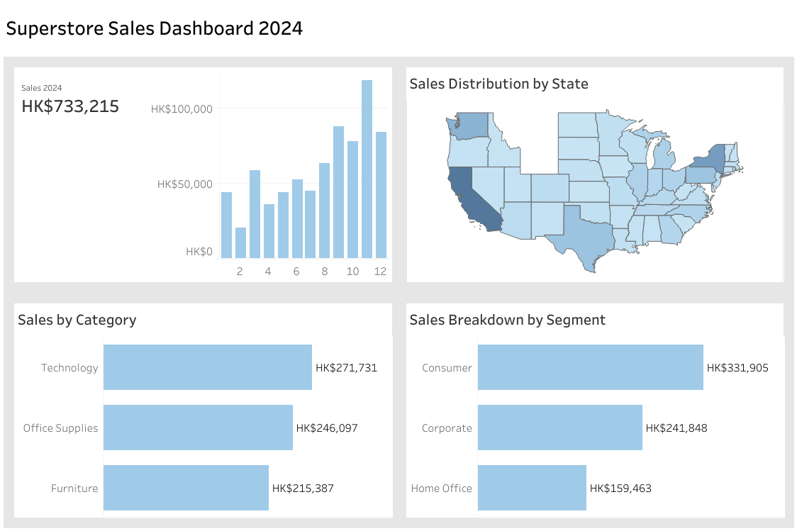

# Superstore Sales Analysis (Tableau)

## Project Overview
This project analyses retail sales data from a Superstore dataset using **Tableau**.  
The objective was to explore overall sales performance, identify geographic sales patterns, and understand how different product categories and customer segments contribute to revenue.

This project was completed as part of **self-learning Tableau**, focusing on building an interactive dashboard and presenting key business insights visually.

---

## Dashboard
View the interactive dashboard on Tableau Public:

https://public.tableau.com/views/SupermarketDashboard_17726383087870/SuperstoreSalesDashboard2024?:language=zh-TW&:sid=&:redirect=auth&:display_count=n&:origin=viz_share_link

---

## Business Questions
The dashboard was designed to answer several key business questions:

- What is the **total sales performance**?
- How did **sales perform in 2024**?
- Which **states generate the highest sales**?
- Which **product categories contribute most to revenue**?
- How does **sales vary across different customer segments**?

---

## Dashboard Features

The Tableau dashboard includes the following visualisations:

**Total Sales KPI**  
Displays the overall sales performance.

**Sales in 2024 (Bar Chart)**  
Shows sales distribution across time to highlight overall performance.

**Sales Distribution by State (Map)**  
Geographical visualisation identifying regions with higher sales.

**Sales by Category (Bar Chart)**  
Compares sales performance across different product categories.

**Sales Breakdown by Segment (Bar Chart)**  
Shows how different customer segments contribute to total sales.

---

## Key Insights

- Sales performance varies significantly across states.
- Certain product categories contribute more strongly to total revenue.
- Different customer segments show different purchasing patterns.

These insights help businesses understand where sales are strongest and which customer groups drive revenue.

---

## Business Recommendations

The analysis highlights several opportunities to improve retail performance:

• Product categories with strong sales performance could be prioritised for inventory allocation and marketing promotions.

• States with high sales performance may represent strong markets where additional marketing investment could increase revenue further.

• Regions with lower sales performance may require targeted promotions or pricing strategies to stimulate demand.

• Monitoring sales by customer segment can help businesses better tailor marketing campaigns to different customer groups.

---

## Tools Used

- **Tableau** – dashboard design and data visualisation
- Data exploration and visual storytelling

---

## Skills Demonstrated

- Tableau dashboard development
- KPI visualisation
- Geographic data visualisation
- Business performance analysis
- Data storytelling with dashboards
